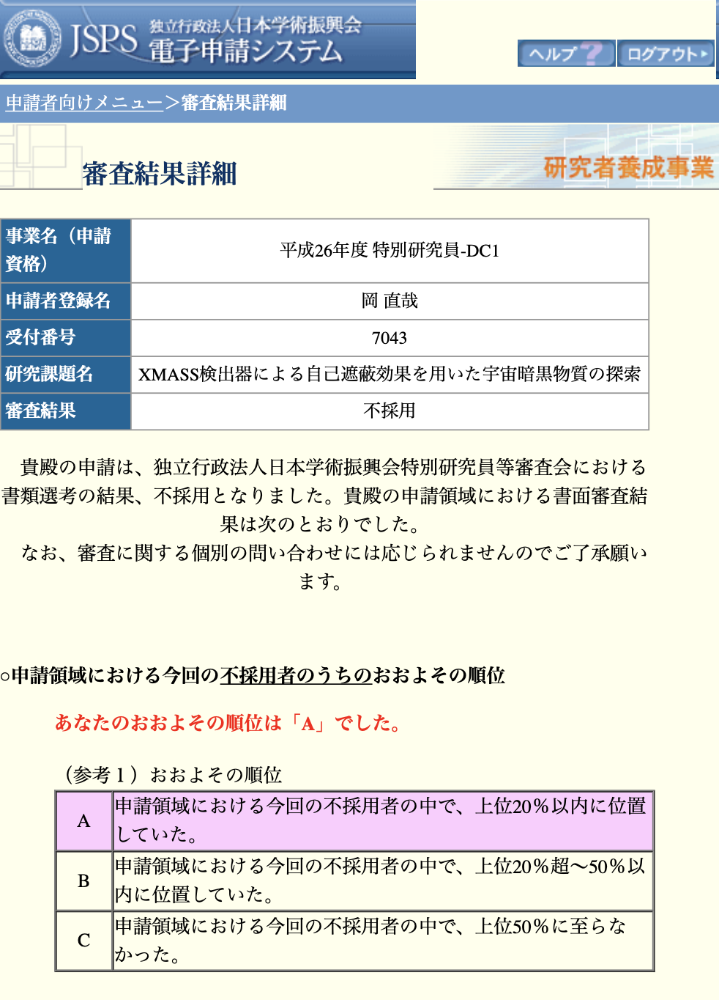
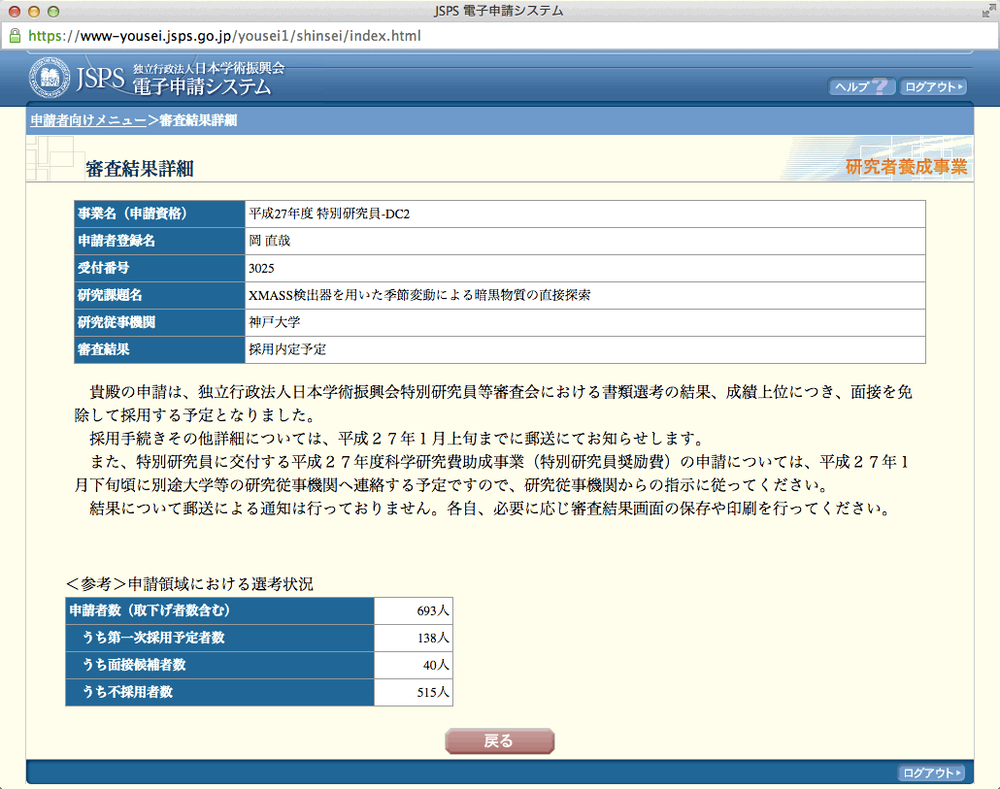

# 学振特別研究員 DC1, DC2 申請書

2013年(2014年度採用)と2014年(2015年度採用)にそれぞれ学振特別研究員 DC1, DC2 に応募したときの書類を公開します。
分野は	素粒子・原子核・宇宙線・宇宙物理(実験) です。
結果は2013年は不採用、2014年は採用でした。

## 内容の説明

- 一番上のディレクトリにあるファイル ([oka_dc1_ver20120522.pdf](oka_dc1_ver20120522.pdf),  [oka_dc2_140527.pdf](oka_dc2_140527.pdf)) が恐らく最終版です。
- それぞれの現存するバージョンがを2013DC1、2014DC2ディレクトリに入っています。途中経過などを見たい場合は参照して下さい。
- なお2013年はMS Word、2014年は[山中TeX](https://osksn2.hep.sci.osaka-u.ac.jp/~taku/kakenhiLaTeX/)で書いています。
- TeXのほうはソースファイルも置いてあります。余計なものがたくさん入っていますが [egg_dc.tex](2014DC2/dc2_2015/egg_dc.tex) が TeX ファイルです。

## コンタクト

何かあれば[イシュー](https://github.com/pn11/jsps-dc/issues)までお願いします。

## リンク

- [KAKEN — 研究課題をさがす | ＸＭＡＳＳ検出器を用いた季節変動による暗黒物質の直接探索 (KAKENHI-PROJECT-15J03025)](https://kaken.nii.ac.jp/grant/KAKENHI-PROJECT-15J03025)
